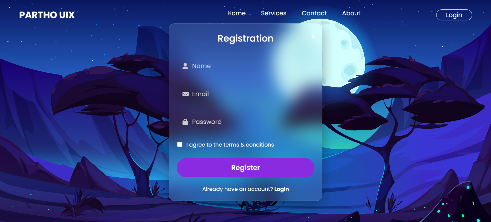

# Responsive Glassmorphism Login UI 💎

A modern, fully responsive login and registration landing page featuring a stunning glassmorphism effect. This project is built with pure HTML, CSS, and a touch of JavaScript to create a beautiful and user-friendly interface.



### 🚀 Live Demo

[**View the live project here**](https://parthobd-ui.github.io/responsive-glassmorphism-login-ui/)

---

### ## 🌟 Features

-   **Modern Glassmorphism Design:** A beautiful "frosted glass" effect on the registration form, making it stand out from the background.
-   **Fully Responsive:** The layout seamlessly adapts to all screen sizes, from large desktops to small mobile phones.
-   **Interactive UI:** Smooth hover effects on buttons and links for a better user experience.
-   **Clean Code:** Well-structured and commented HTML, CSS, and JavaScript for easy understanding.
-   **Font Awesome Icons:** Icons are used in input fields for better usability.

---

### ## 🛠️ Technologies Used

-   **HTML5:** For the basic structure of the page.
-   **CSS3:** For all styling, including:
    -   **Flexbox:** For creating the main layout of the navbar and form.
    -   **Media Queries:** For making the page responsive.
    -   **Backdrop Filter:** To achieve the glassmorphism effect.
-   **JavaScript:** For basic DOM manipulation and form interactions.
-   **Font Awesome:** For icons.

---

### ## ⚙️ How to Use

To run this project on your local machine, follow these simple steps:

1.  **Clone the repository:**
    ```sh
    git clone [https://github.com/ParthoBD-UI/responsive-glassmorphism-login-ui.git](https://github.com/ParthoBD-UI/responsive-glassmorphism-login-ui.git)
    ```
2.  **Navigate to the project directory:**
    ```sh
    cd responsive-glassmorphism-login-ui
    ```
3.  **Open the `index.html` file in your browser.**

---
